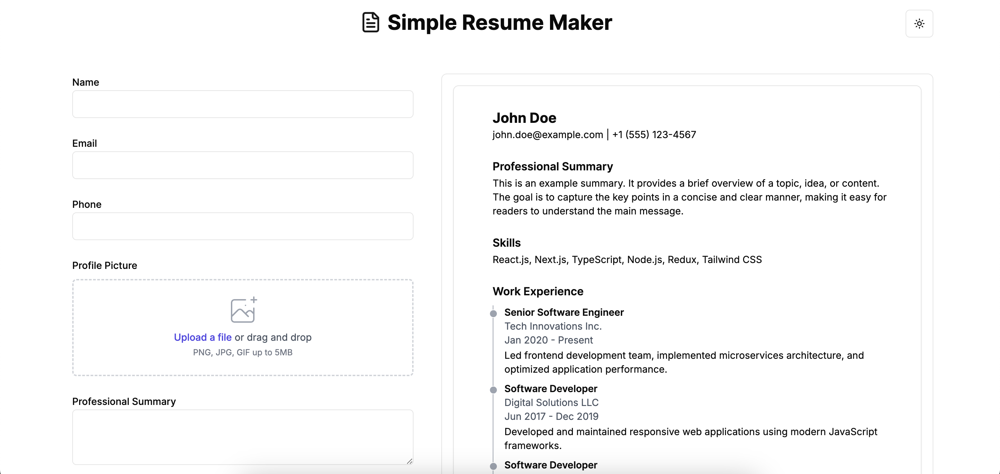

# Simple Resume Maker - Next.js with ShadCN

A simple, responsive, and customizable resume maker built with Next.js and styled with the ShadCN design system. This web application allows users to input their personal details, work experience, education, and skills to generate a downloadable PDF resume. Perfect for anyone in need of a quick and professional-looking resume!




## Features

- **Dynamic Resume Creation:** Input personal details, work experience, education, and skills to generate a professional resume.
- **ShadCN Design System:** Beautiful, responsive UI components powered by ShadCN for a seamless user experience.
- **PDF Download:** After filling out the form, users can generate and download their resume as a PDF.
- **Responsive Layout:** Fully responsive design, optimized for both mobile and desktop views.

## Technologies Used

- **Next.js:** A React framework for building static and dynamic web applications.
- **ShadCN:** A utility-first design system with ready-to-use components for fast UI development.

## Installation

To get started with this project, follow these steps:

### 1. Clone the Repository

First, clone the repository to your local machine. You can do this by running the following command in your terminal:

```bash
git clone https://github.com/thesurjo/resume-maker.git
```
```bash
cd resume-maker
```

### 2. Install Dependencies

Once the repository is cloned, navigate into the project directory (`cd resume-maker`) and install the necessary dependencies by running:

```bash
npm install
```

###  3. Run the Development Server
Once the dependencies are installed, you can run the development server with:

```bash
npm run dev
```

## How to Use

1. **Fill in Your Details:**
   Open the app in your browser. You'll see several sections where you can input your personal information, such as name, contact details, work experience, education, and skills.

2. **Preview Resume:**
   After filling in all the necessary fields, it will show you a previw in the right side in desktop.

3. **Download Your Resume:**
   You will have the option to download it as a PDF file. The PDF will be formatted according to the template and your personal data.

## Contributing

We welcome contributions to improve the project! If you'd like to contribute, here are a few ways to get started:

1. **Fork the repository** and clone it to your local machine.
2. **Create a new branch** for your feature or bugfix.
3. **Make your changes**, ensuring that the code follows the existing style and conventions.
4. **Commit your changes** and push the branch to your fork.
5. **Create a pull request** detailing the changes you've made.

We appreciate all contributions, whether big or small. If you find a bug or have an idea for a feature, please open an issue.

